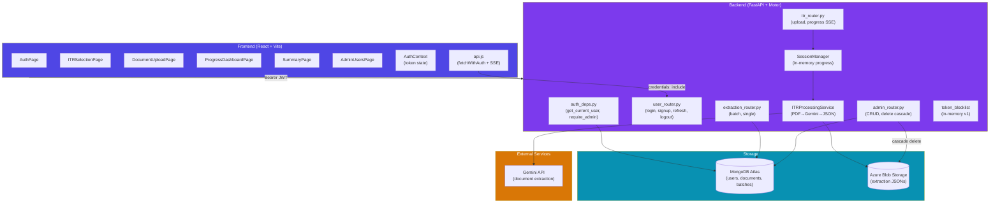
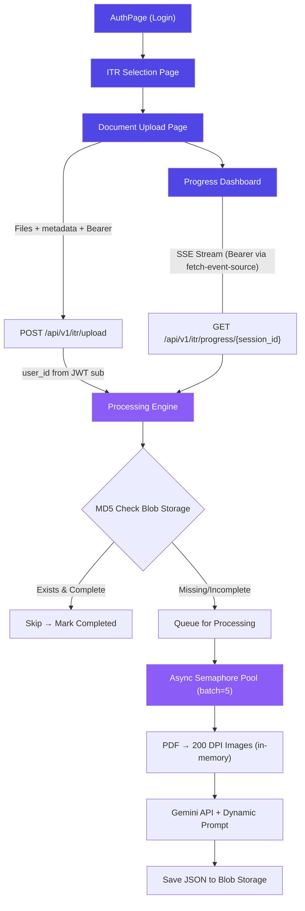
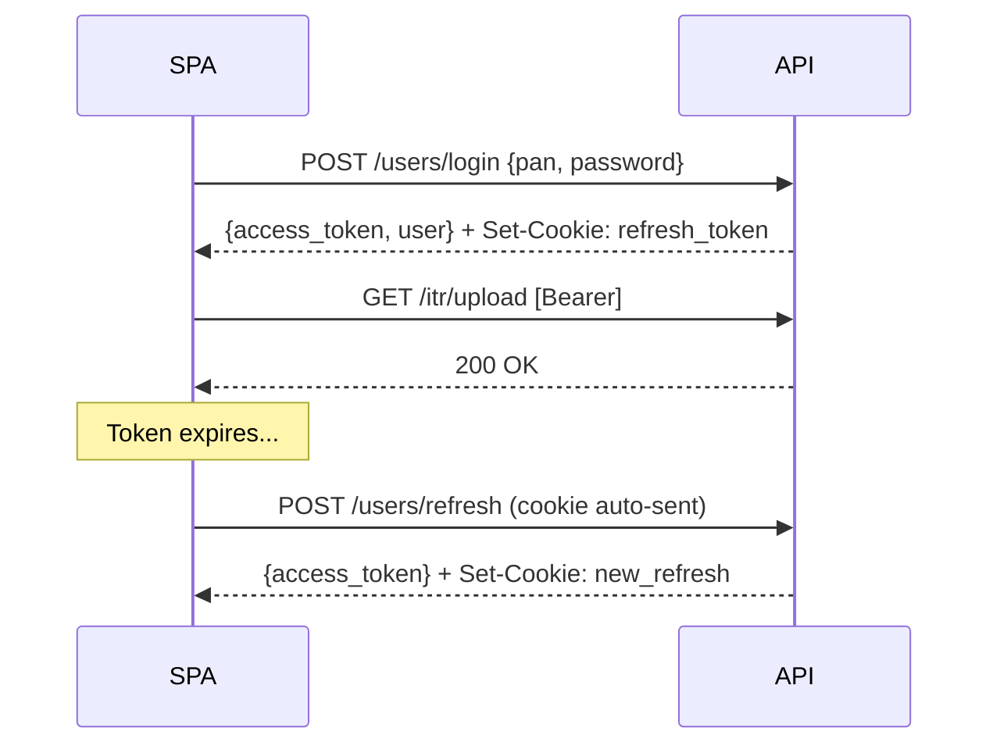

# ITR Filing App — Architecture Overview

> **Living document** — update when architecture changes. Agents should reference specific sections, not the entire file.
> **Last updated**: 2026-04-19

---

## Table of Contents

- [System Architecture](#system-architecture)
- [Document Processing Flow](#document-processing-flow)
- [Authentication & Authorization](#authentication--authorization)
- [Tech Stack](#tech-stack)
- [Key Design Decisions](#key-design-decisions)
- [Sub-Documents](#sub-documents)

---

## System Architecture

---

## Document Processing Flow

---

## Authentication & Authorization

> Full details in [docs/auth.md](auth.md)

### Summary

- **JWT access + refresh** token pair with `PyJWT[crypto]`
- **Access token**: short-lived (30 min), in-memory (React state), sent as `Authorization: Bearer`
- **Refresh token**: long-lived (7 days), `HttpOnly; Secure; SameSite=Strict` cookie
- **Roles**: `admin` | `user` — stored in `users.role`, carried in access token claims
- **Page refresh**: silent `/users/refresh` call restores session from cookie
- **Route guards**: `ProtectedRoute` checks auth only (not page flow); backend enforces ownership

### Auth Flow (condensed)

---

## Tech Stack

| Layer | Technology | Rationale |
|-------|-----------|-----------|
| **Frontend** | React 18 + Vite | Fast HMR, minimal config |
| **Routing** | react-router-dom v6 | Nested routes, layout routes |
| **Auth state** | React Context + in-memory tokens | No external state library needed for auth |
| **SSE client** | `@microsoft/fetch-event-source` | Supports custom headers (Bearer) unlike native `EventSource` |
| **Backend** | FastAPI + Uvicorn | Async-native, auto-docs, Pydantic validation |
| **Database** | MongoDB Atlas + Motor | Async driver, flexible schema for document extraction |
| **Encryption** | CSFLE (Client-Side Field Level) | PII encrypted at rest; deterministic for indexed lookups |
| **Password hashing** | Argon2 (via passlib) | Winner of PHC 2015; 64MB memory cost |
| **JWT** | PyJWT[crypto] | Actively maintained; HS256 signing |
| **Blob storage** | Azure Blob Storage (async) | Per-user/AY/doc-type hierarchy; MD5 dedup caching |
| **AI extraction** | Google Gemini API | Vision model for document-to-JSON extraction |

---

## Key Design Decisions

| Decision | Rationale |
|----------|-----------|
| **In-memory buffer** | `io.BytesIO` and `fitz` stream for zero-disk persistence of uploaded files |
| **Concurrency** | `asyncio.Semaphore(5)` to respect Gemini API rate limits |
| **Real-time progress** | `sse-starlette` + `fetch-event-source` for server-to-client broadcasting with auth |
| **MD5 dedup** | Blob Storage path-based caching avoids re-extracting identical documents |
| **HttpOnly refresh cookie** | Prod-grade XSS protection; survives page refresh without localStorage risk |
| **Auth gate, not flow gate** | `ProtectedRoute` only checks authentication — doesn't enforce page ordering, preserving natural URL navigation for authenticated users |
| **Deterministic ObjectId** | User `_id` derived from identity fields via BLAKE2b for idempotent user creation |
| **Mongo-first delete cascade** | On user deletion: Mongo docs deleted first, blobs second. Orphan blobs are recoverable; dangling user docs are not. |
| **In-memory token blocklist (v1)** | Zero-infra for dev; documented upgrade path to Mongo TTL in [auth.md](auth.md#6-token-blocklist-scaling) |

---

## Sub-Documents

Detailed architecture for specific subsystems. Reference these when working on related tasks.

| Document | Scope | When to reference |
|----------|-------|-------------------|
| [auth.md](auth.md) | JWT tokens, blocklist scaling, RBAC, threat model, admin operations | Any auth/authorization task, token handling, admin user management |
