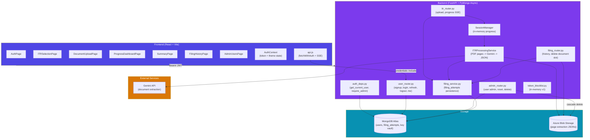
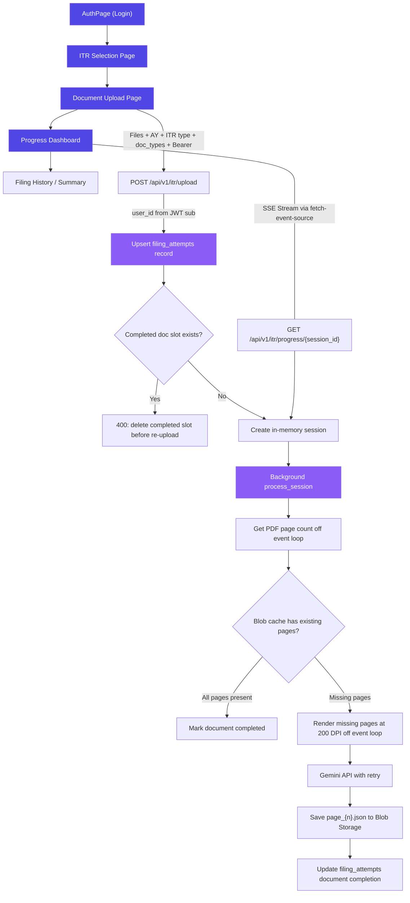
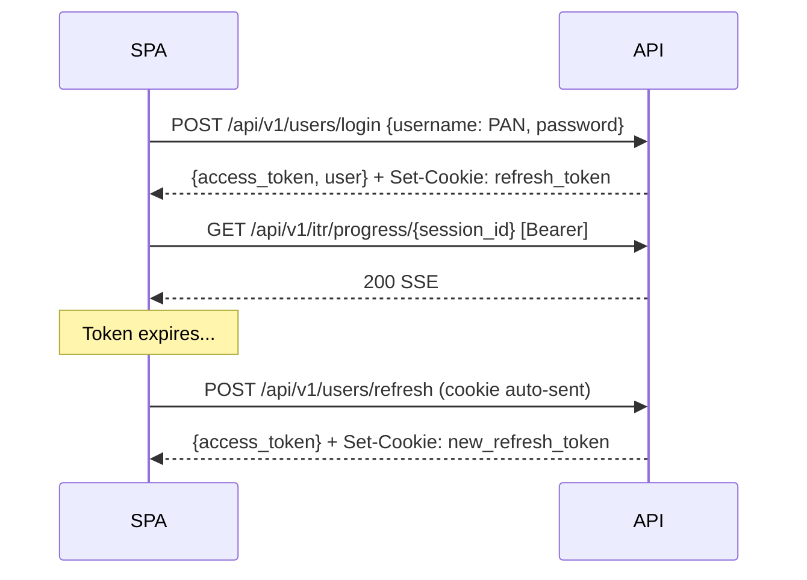

# ITR Filing App — Architecture Overview

> **Living document** — update when architecture changes. Agents should reference specific sections, not the entire file.
> **Last updated**: 2026-04-24

---

## Table of Contents

- [System Architecture](#system-architecture)
- [Document Processing Flow](#document-processing-flow)
- [Authentication & Authorization](#authentication--authorization)
- [Tech Stack](#tech-stack)
- [Key Design Decisions](#key-design-decisions)
- [Sub-Documents](#sub-documents)

---

## System Architecture

---

## Document Processing Flow

---

## Authentication & Authorization

> Full details in [docs/auth.md](auth.md)

### Summary

- **JWT access + refresh** token pair with `PyJWT[crypto]`
- **Access token**: short-lived, configurable by `ACCESS_TOKEN_EXPIRE_MINUTES`, stored in React state, sent as `Authorization: Bearer`
- **Refresh token**: configurable by `REFRESH_TOKEN_EXPIRE_DAYS`, stored in an `HttpOnly` cookie scoped to `/api/v1/users/refresh`
- **Roles**: `admin` | `user` — stored encrypted in Mongo and carried in access token claims
- **Page refresh**: silent `/users/refresh` call restores session from cookie
- **Route guards**: `ProtectedRoute` checks auth/admin role in the UI; backend dependencies enforce access

### Auth Flow (condensed)

---

## Tech Stack

| Layer | Technology | Rationale |
|-------|-----------|-----------|
| **Frontend** | React 19 + Vite 8 | Fast HMR, simple app shell |
| **Routing** | react-router-dom 7 | Layout routes and protected route nesting |
| **Auth state** | React Context + in-memory access token | Keeps auth simple without localStorage access-token persistence |
| **SSE client** | `@microsoft/fetch-event-source` | Supports custom Bearer headers unlike native `EventSource` |
| **Backend** | FastAPI + Uvicorn | Async-native, auto-docs, Pydantic validation |
| **Database** | MongoDB Atlas + PyMongo | Native `AsyncMongoClient`, flexible document model |
| **Encryption** | CSFLE explicit encryption | PII encrypted at rest; synchronous crypto boundary offloaded via `asyncio.to_thread` |
| **Password hashing** | Argon2 via passlib | Memory-hard password hashing, offloaded to worker threads |
| **JWT** | PyJWT[crypto] | HS256 signing and validation |
| **Blob storage** | Azure Blob Storage async client | Per-user/AY/doc-type/hash hierarchy for extraction JSONs |
| **AI extraction** | Google Gemini API | Vision model for page-level document extraction |

---

## Key Design Decisions

| Decision | Rationale |
|----------|-----------|
| **Progressive agent loading** | Gemini starts with `GEMINI.md` + `AGENTS.md`; task-specific skills/docs/specs are opened only when relevant |
| **Development branch as default target** | Agent-created PRs target `development` even if GitHub remote HEAD points elsewhere |
| **In-memory source document handling** | Uploaded files are read into memory and processed without writing source PDFs to disk |
| **PyMuPDF offload** | PDF page counting and rasterization run via worker threads to keep the event loop responsive |
| **Concurrency** | `asyncio.Semaphore(5)` limits concurrent Gemini page calls |
| **Real-time progress** | `sse-starlette` + `fetch-event-source` broadcasts in-memory session state with Bearer auth |
| **MD5 page cache** | Blob Storage path-based caching skips already-extracted pages for the same user/AY/doc/hash |
| **Completed-slot protection** | Completed filing documents must be deleted from filing history before re-uploading a replacement |
| **HttpOnly refresh cookie** | Refresh tokens are not exposed to JavaScript and are path-scoped to the refresh endpoint |
| **Auth gate, not flow gate** | `ProtectedRoute` checks auth/admin role; page-specific prerequisites redirect at the page level |
| **Deterministic ObjectId** | User `_id` is a BSON ObjectId derived from a 12-byte BLAKE2b digest of normalized identity fields |
| **Sequential delete cascade** | Admin deletion removes filing attempts, blobs, then user profile; it is not a Mongo transaction |
| **In-memory token blocklist (v1)** | Zero-infra dev revocation with documented upgrade path to Mongo TTL in [auth.md](auth.md#6-token-blocklist-scaling) |

---

## Sub-Documents

Detailed architecture for specific subsystems. Reference these when working on related tasks.

| Document | Scope | When to reference |
|----------|-------|-------------------|
| [auth.md](auth.md) | JWT tokens, blocklist scaling, RBAC, route protection, admin operations | Any auth/authorization task, token handling, admin user management |
