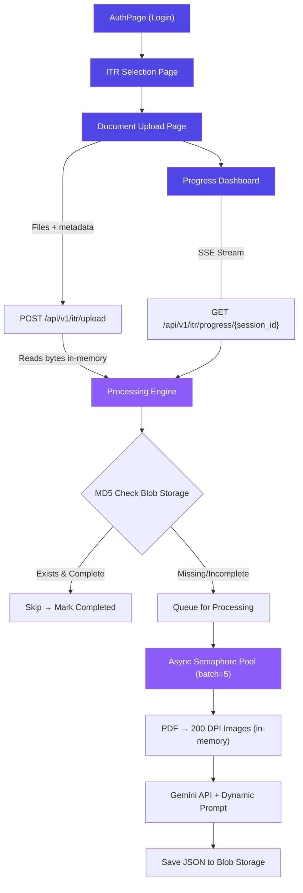

# ITR Filing App - Architecture Overview

## Document Processing Flow

## Tech Stack Decisions

- **In-Memory Buffer**: Using `io.BytesIO` and `fitz` stream for zero-disk persistence.
- **Concurrency**: `asyncio.Semaphore(5)` to manage Gemini API rate limits.
- **Real-time**: `sse-starlette` for server-to-client progress broadcasting.
- **Caching**: MD5-based deduplication on Azure Blob Storage.
- **Routing**: `react-router-dom` for the guided user journey.
