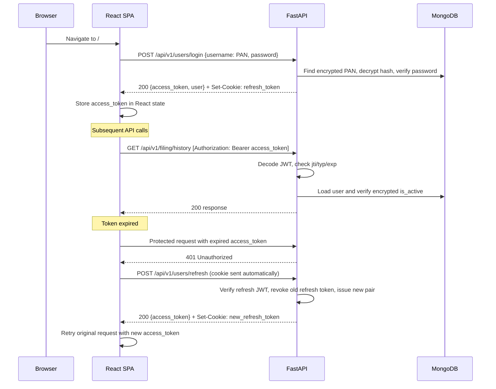
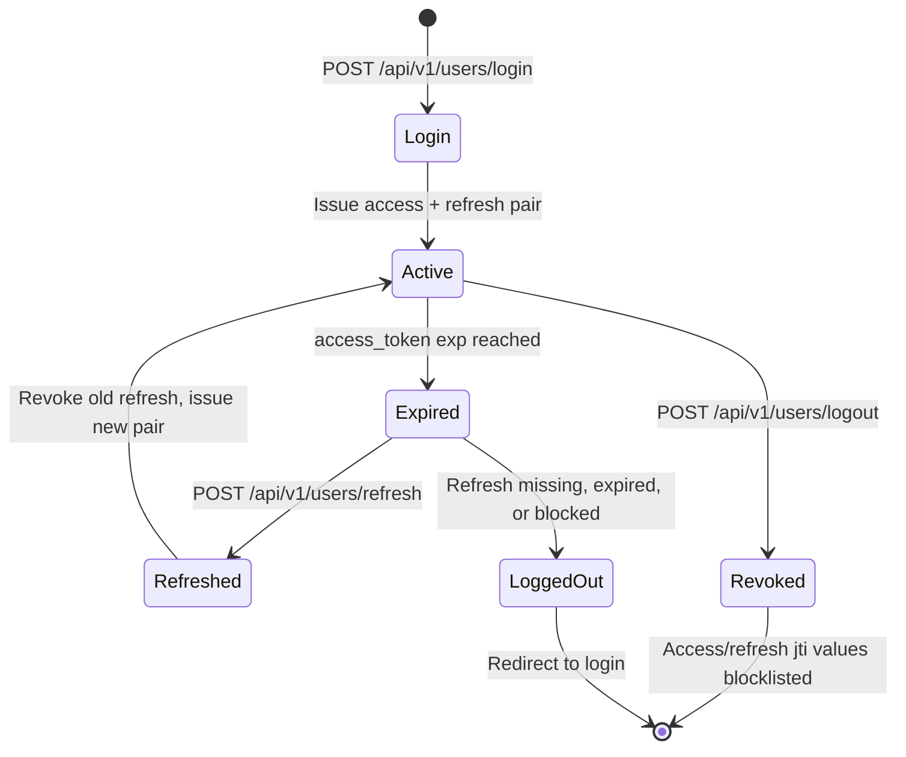
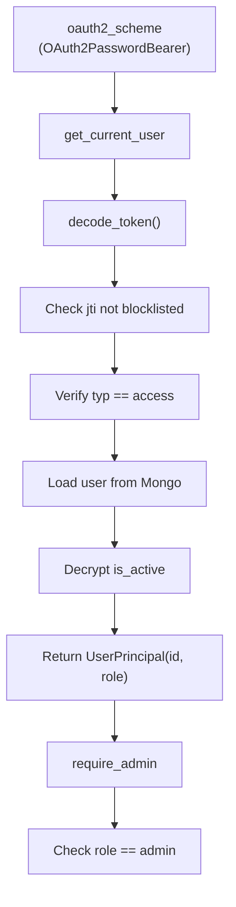
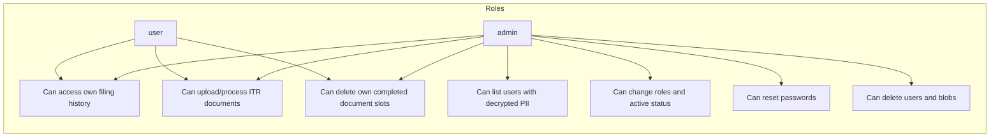
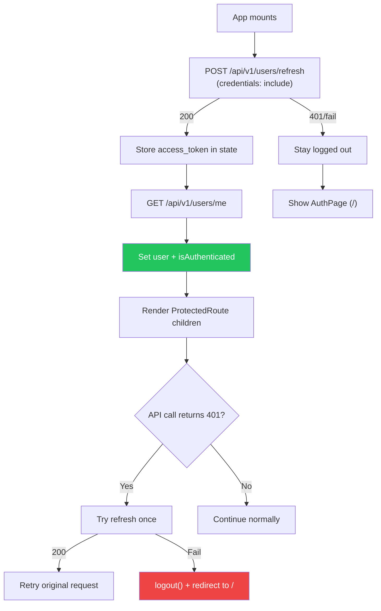
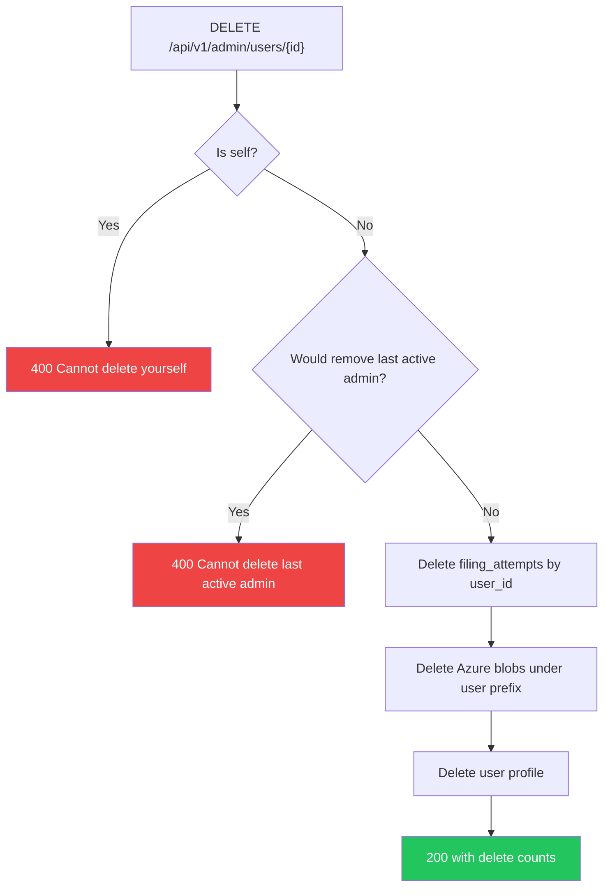

# Authentication & Authorization Architecture

> **Scope**: JWT-based auth with role-based access control (RBAC) for the ITR Filing App.
> **Last updated**: 2026-04-24

---

## Table of Contents

- [1. Overview](#1-overview)
- [2. Token Lifecycle](#2-token-lifecycle)
- [3. Token Transport & Storage](#3-token-transport--storage)
- [4. Auth Dependencies (FastAPI)](#4-auth-dependencies-fastapi)
- [5. Token Blocklist](#5-token-blocklist)
- [6. Token Blocklist Scaling](#6-token-blocklist-scaling)
- [7. User Roles & Permissions](#7-user-roles--permissions)
- [8. Route Protection Matrix](#8-route-protection-matrix)
- [9. Frontend Auth Flow](#9-frontend-auth-flow)
- [10. Security Threat Model](#10-security-threat-model)
- [11. Admin Operations](#11-admin-operations)
- [12. Future Considerations](#12-future-considerations)

---

## 1. Overview

The app uses a JWT access/refresh token pair with the following properties:

- **Access token**: short-lived, configurable by `ACCESS_TOKEN_EXPIRE_MINUTES`, sent as `Authorization: Bearer`
- **Refresh token**: configurable by `REFRESH_TOKEN_EXPIRE_DAYS`, stored as a path-scoped `HttpOnly` cookie
- **Roles**: `admin` | `user` — stored encrypted in Mongo `users.role`, included in access token claims
- **Session survival**: page refresh triggers a silent `POST /api/v1/users/refresh` call using the cookie
- **Branch policy for agent work**: PRs target `development` unless the user explicitly asks otherwise



---

## 2. Token Lifecycle

### Access Token Claims

```json
{
  "sub": "60d5ec49f1a4a20001c8e4b2",
  "role": "admin",
  "typ": "access",
  "exp": 1750000000,
  "iat": 1749998200,
  "jti": "a1b2c3d4-e5f6-7890-abcd-ef1234567890"
}
```

### Refresh Token Claims

```json
{
  "sub": "60d5ec49f1a4a20001c8e4b2",
  "typ": "refresh",
  "exp": 1750604200,
  "jti": "f0e1d2c3-b4a5-6789-0fed-cba987654321"
}
```

### Token Lifecycle Flow



### Key Rules

1. **Never put PII in tokens** — only `sub`, `role`, `typ`, `iat`, `exp`, and `jti`
2. **Refresh rotation** — each refresh revokes the previous refresh token and returns a new access/refresh pair
3. **Blocklist check** — every token decode checks `jti` against the in-memory blocklist
4. **`is_active` check** — every protected request reloads the user and decrypts `is_active`

---

## 3. Token Transport & Storage

| Token | Transport | Storage | Notes |
|-------|-----------|---------|-------|
| Access | `Authorization: Bearer` header | React state/module memory | Not persisted to `localStorage`; active XSS remains high impact |
| Refresh | `Set-Cookie` from API | Browser cookie jar | `HttpOnly`, path-scoped to `/api/v1/users/refresh`; `Secure` + `SameSite=Strict` in production, `SameSite=Lax` in debug |

### Why this combination?

- **Access in memory**: avoids durable browser storage for bearer credentials.
- **Refresh in HttpOnly cookie**: JavaScript cannot read the refresh token directly.
- **Path-scoped cookie**: the refresh cookie is only sent to `/api/v1/users/refresh`.
- **Refresh rotation**: a stolen older refresh token is invalid after successful rotation.

### CORS Requirement

For `credentials: 'include'` to work:
- `Access-Control-Allow-Origin` must use explicit origins, not `*`
- `Access-Control-Allow-Credentials` must be `true`
- Origins are configured via `cors_allowed_origins` in `backend/settings.py`

---

## 4. Auth Dependencies (FastAPI)

### Dependency Chain



### `UserPrincipal` (lightweight auth identity)

```python
@dataclass
class UserPrincipal:
    id: str
    role: str
```

This is deliberately minimal. For full user details, services reload and decrypt the user document.

---

## 5. Token Blocklist

### Purpose

The blocklist tracks revoked `jti` values until their natural expiry. It is used for:
- **Logout**: revoke current access token and refresh cookie token if present
- **Refresh rotation**: revoke the old refresh token after issuing a new pair
- **Admin self password reset**: revoke the current admin session when an admin resets their own password

### Current Implementation (v1): In-Memory

```python
# backend/services/token_blocklist.py
_blocklist: dict[str, float] = {}   # jti -> expiry timestamp
```

**Characteristics:**
- Zero infrastructure overhead
- Correct for a single-process development server
- Data lost on process restart
- Not suitable for multi-process production because each worker has its own dict
- The app does not currently maintain a persistent per-user refresh-token registry, so admin reset-password does not revoke all sessions for another user

---

## 6. Token Blocklist Scaling

> This section documents the upgrade path from in-memory to shared blocklist for production deployments.

### When to Upgrade

Upgrade from in-memory when any of these are true:
- Running with multiple workers
- Running multiple app instances behind a load balancer
- Compliance requires revocation to be effective across every process immediately

### Option A: MongoDB TTL Collection (Recommended)

**Why Mongo?** Already in the stack; no new infrastructure.

```javascript
// Collection: token_blocklist
{
  "jti": "a1b2c3d4-e5f6-7890-abcd-ef1234567890",
  "exp": ISODate("2026-04-26T13:00:00Z"),
  "blocked_at": ISODate("2026-04-24T13:00:00Z"),
  "reason": "logout"
}

db.token_blocklist.createIndex({ "exp": 1 }, { expireAfterSeconds: 0 })
db.token_blocklist.createIndex({ "jti": 1 }, { unique: true })
```

**Migration steps:**
1. Create the collection and indexes in `DatabaseManager._ensure_indexes()`
2. Replace `token_blocklist.py` functions with async PyMongo queries
3. Add `"token_blocklist"` to the test cleanup collection list

**Trade-offs:**
- (+) Zero new infrastructure
- (+) TTL index handles cleanup
- (-) One DB write per logout/refresh rotation
- (-) One DB read per token verification

### Option B: Redis SET with TTL

```
SET blocklist:{jti} 1 EX {seconds_until_token_expiry}
EXISTS blocklist:{jti}
```

**Trade-offs:**
- (+) Very fast lookup
- (-) New infrastructure dependency
- (-) Requires async Redis connection management

### Recommendation

Use Mongo TTL first unless profiling shows token verification is a bottleneck.

---

## 7. User Roles & Permissions

### Role Model



### User Document Fields

| Field | Type | Encryption | Notes |
|-------|------|------------|-------|
| `role` | `str` | Deterministic CSFLE | Exact-match admin counts require deterministic encryption |
| `is_active` | bool-as-int | Deterministic CSFLE | Decrypted on every protected request |
| identity fields | `str` | Deterministic CSFLE | PAN/email lookups require exact-match queries |
| `password` | Argon2 hash string | Random CSFLE | Never returned by API responses |

---

## 8. Route Protection Matrix

All routes are mounted under `/api`.

### Backend (FastAPI)

| Route | Dependency | Notes |
|-------|------------|-------|
| `POST /api/v1/users/signup` | None | Public |
| `POST /api/v1/users/login` | None | Public OAuth2 form login using PAN as `username` |
| `POST /api/v1/users/refresh` | Refresh cookie | Rotates refresh token and returns new access token |
| `POST /api/v1/users/logout` | `get_current_user` | Revokes access token and refresh cookie token if present |
| `GET /api/v1/users/me` | `get_current_user` | Returns masked user profile |
| `POST /api/v1/itr/upload` | `get_current_user` | Uses JWT `sub` as owner; rejects completed duplicate document slots |
| `GET /api/v1/itr/progress/{session_id}` | `get_current_user` | SSE stream scoped to session owner |
| `GET /api/v1/filing/history` | `get_current_user` | Lists the current user's filing attempts |
| `GET /api/v1/filing/history/{assessment_year}` | `get_current_user` | Returns one filing attempt for the current user |
| `DELETE /api/v1/filing/history/{assessment_year}/{doc_type}` | `get_current_user` | Deletes the user's document slot and associated blobs |
| `GET /api/v1/admin/users` | `require_admin` | Paginated user list with decrypted PII except password |
| `PATCH /api/v1/admin/users/{user_id}/role` | `require_admin` | Last-admin guard |
| `PATCH /api/v1/admin/users/{user_id}/status` | `require_admin` | Self-deactivation and last-admin guards |
| `DELETE /api/v1/admin/users/{user_id}` | `require_admin` | Self-delete and last-admin guards; cascade delete |
| `POST /api/v1/admin/users/bulk-delete` | `require_admin` | Skips self-deletion |
| `POST /api/v1/admin/users/{user_id}/reset-password` | `require_admin` | Validates strength, hashes, encrypts, updates password |

### Frontend (React)

| Route | Guard | Notes |
|-------|-------|-------|
| `/` | None | Auth page |
| `/itr-select` | `ProtectedRoute` | Auth check only |
| `/upload` | `ProtectedRoute` | Auth check plus page-level AY guard |
| `/progress` | `ProtectedRoute` | Auth check plus page-level `sessionId` guard |
| `/summary` | `ProtectedRoute` | Auth check |
| `/filing-history` | `ProtectedRoute` | Auth check |
| `/admin/users` | `ProtectedRoute requireAdmin` | Auth and client-side admin role check |

> **Design principle**: `ProtectedRoute` is an auth/admin gate, not a full flow gate. Page-specific prerequisites are handled by page components.

---

## 9. Frontend Auth Flow



---

## 10. Security Threat Model

| Threat | Current mitigation |
|--------|--------------------|
| **Access token persistence** | Access token lives in React/module memory, not `localStorage` |
| **Refresh token theft by JS** | `HttpOnly` cookie blocks direct JavaScript reads |
| **CSRF against refresh** | Production uses `SameSite=Strict` and a path-scoped refresh cookie |
| **Token replay after logout** | In-memory `jti` blocklist rejects revoked tokens in the same process |
| **Refresh replay after rotation** | Old refresh `jti` is blocklisted during refresh |
| **Spoofed upload ownership** | Upload owner comes from JWT `sub`, not form data |
| **Cross-user SSE eavesdrop** | Session owner is checked before streaming state |
| **Cross-user filing history access** | Filing queries filter by authenticated `user_id` |
| **URL manipulation to admin pages** | Frontend checks role; backend returns 403 through `require_admin` |
| **Inactive account reuse** | `get_current_user` decrypts and checks `is_active` on every protected request |
| **Password brute force/offline attack** | Argon2 hashing with 64 MB memory cost; login rate limiting is not yet implemented |

---

## 11. Admin Operations

### User Cascade Delete



The cascade is sequential, not a Mongo transaction. If blob deletion fails, the request can fail after filing records are deleted; retry/compensation should be added before production hardening.

### Force Reset Password

1. Admin submits `POST /api/v1/admin/users/{id}/reset-password` with `{ "new_password": "..." }`
2. Server validates password strength using the same complexity rules as signup
3. Server hashes with Argon2 via a worker thread
4. Server encrypts the hash with random CSFLE and stores it in `users.password`
5. If the admin reset their own password, the current access/refresh tokens are revoked and the refresh cookie is cleared

---

## 12. Future Considerations

| Item | Priority | Notes |
|------|----------|-------|
| Rate limiting (login) | High | Per-IP and per-PAN throttling before production |
| Token blocklist to Mongo TTL | Medium | See [section 6](#6-token-blocklist-scaling) |
| Per-user refresh session registry | Medium | Needed to revoke all sessions on admin password reset |
| Transactional/compensating cascade delete | Medium | Avoid partial deletion across Mongo and Blob Storage |
| Audit log | Medium | Track admin actions such as role changes, deletions, password resets |
| CSP and XSS hardening | Medium | Reduce token misuse risk from active script injection |
| RS256 signing | Low | Useful if token validation moves across services |
