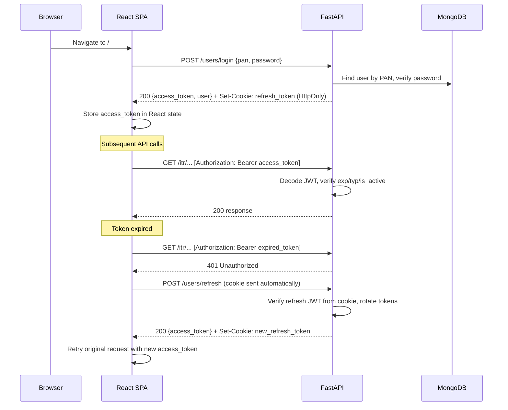
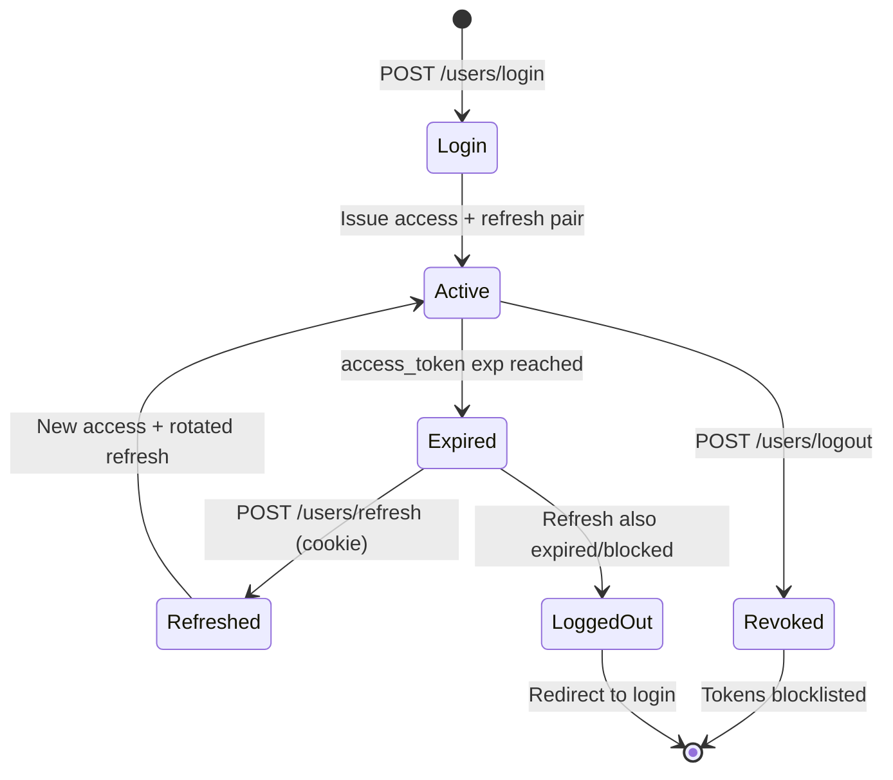
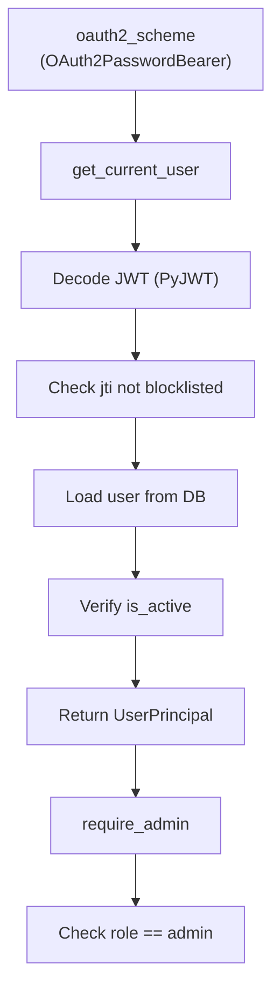
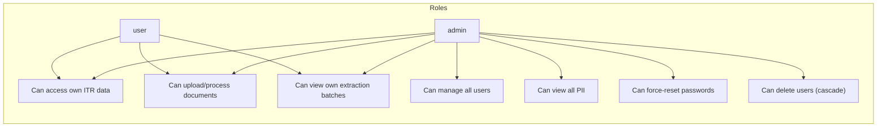
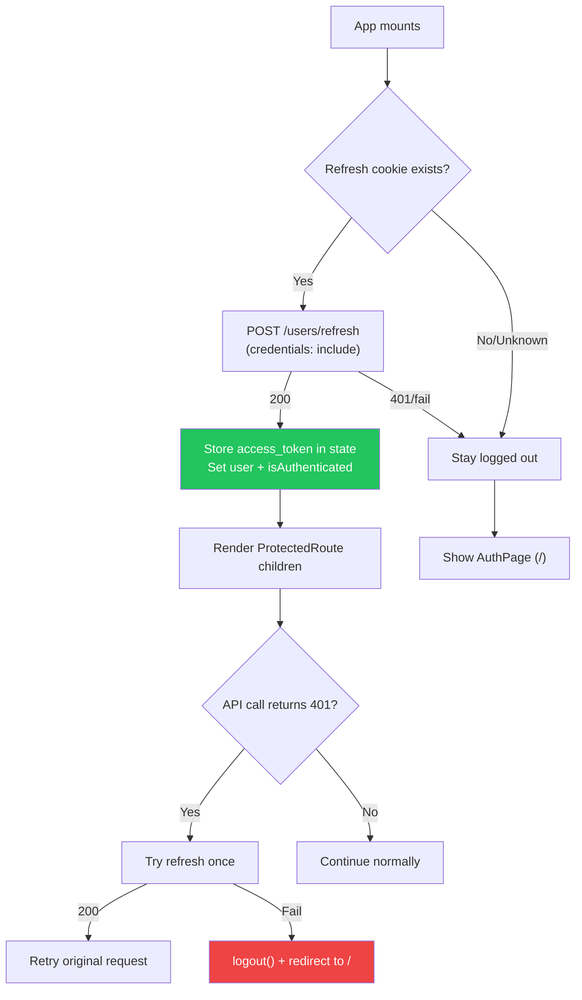
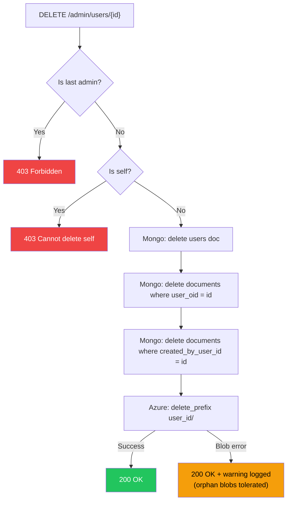

# Authentication & Authorization Architecture

> **Scope**: JWT-based auth with role-based access control (RBAC) for the ITR Filing App.
> **Last updated**: 2026-04-19

---

## Table of Contents

- [1. Overview](#1-overview)
- [2. Token Lifecycle](#2-token-lifecycle)
- [3. Token Transport & Storage](#3-token-transport--storage)
- [4. Auth Dependencies (FastAPI)](#4-auth-dependencies-fastapi)
- [5. Token Blocklist](#5-token-blocklist)
- [6. Token Blocklist Scaling](#6-token-blocklist-scaling)
- [7. User Roles & Permissions](#7-user-roles--permissions)
- [8. Route Protection Matrix](#8-route-protection-matrix)
- [9. Frontend Auth Flow](#9-frontend-auth-flow)
- [10. Security Threat Model](#10-security-threat-model)
- [11. Admin Operations](#11-admin-operations)
- [12. Future Considerations](#12-future-considerations)

---

## 1. Overview

The app uses a **stateless JWT** access/refresh token pair with the following properties:

- **Access token**: short-lived (30 min), sent as `Authorization: Bearer` header
- **Refresh token**: long-lived (7 days), stored as `HttpOnly; Secure; SameSite=Strict` cookie
- **Roles**: `admin` | `user` — stored in Mongo `users.role`, included in access token claims
- **Session survival**: page refresh triggers a silent `/users/refresh` call using the cookie



---

## 2. Token Lifecycle

### Access Token Claims

```json
{
  "sub": "60d5ec49f1a4a20001c8e4b2",
  "role": "admin",
  "typ": "access",
  "exp": 1750000000,
  "iat": 1749998200,
  "jti": "a1b2c3d4-e5f6-7890-abcd-ef1234567890"
}
```

### Refresh Token Claims

```json
{
  "sub": "60d5ec49f1a4a20001c8e4b2",
  "typ": "refresh",
  "exp": 1750604200,
  "jti": "f0e1d2c3-b4a5-6789-0fed-cba987654321"
}
```

### Token Lifecycle Flow



### Key Rules

1. **Never put PII in tokens** — only `sub` (ObjectId string) and `role`
2. **Mandatory refresh rotation** — each refresh invalidates the old `jti` and issues a new pair
3. **Blocklist check** — every token decode checks `jti` against the blocklist before proceeding
4. **`is_active` check** — even with a valid token, the DB user must have `is_active=True`

---

## 3. Token Transport & Storage

| Token | Transport | Storage | XSS-safe? | CSRF-safe? |
|-------|-----------|---------|-----------|------------|
| Access | `Authorization: Bearer` header | React state (memory) | ✅ Cannot persist across XSS | N/A (not auto-sent) |
| Refresh | `Set-Cookie: HttpOnly; Secure; SameSite=Strict; Path=/api/v1/users/refresh` | Browser cookie jar | ✅ HttpOnly blocks JS access | ✅ SameSite=Strict + Path scoping |

### Why this combination?

- **Access in memory**: XSS cannot exfiltrate it from a JSON response after it's stored in React state. It's re-attached manually to each request header.
- **Refresh in HttpOnly cookie**: Even if XSS occurs, the attacker cannot read the refresh token. The `SameSite=Strict` flag prevents CSRF because the cookie is only sent on same-site navigations, never cross-origin.
- **Path-scoped cookie**: The refresh cookie is scoped to `/api/v1/users/refresh` only, so it's never sent with other API requests — minimizing exposure surface.

### CORS Requirement

For `credentials: 'include'` to work:
- `Access-Control-Allow-Origin` **must not** be `*` — use specific origin(s)
- `Access-Control-Allow-Credentials` must be `true`

---

## 4. Auth Dependencies (FastAPI)

### Dependency Chain



### `UserPrincipal` (lightweight auth identity)

```python
@dataclass
class UserPrincipal:
    id: str      # ObjectId string (from JWT sub)
    role: str    # "admin" | "user"
```

This is deliberately minimal — it's not a full user document. The access token carries `sub` and `role`, which are verified against the DB on every request (to catch deactivated users).

---

## 5. Token Blocklist

### Purpose

The blocklist tracks revoked `jti` values to invalidate tokens before their natural expiry. Required for:
- **Logout**: blocklist the refresh token's `jti`
- **Password reset by admin**: blocklist all of a user's active refresh `jti`s
- **Refresh rotation**: blocklist the old refresh `jti` after issuing a new pair

### Current Implementation (v1): In-Memory

```python
# backend/services/token_blocklist.py
_blocklist: dict[str, float] = {}   # jti → expiry timestamp
```

**Characteristics:**
- Zero infrastructure overhead
- Correct for single-process `uvicorn` dev server
- Data lost on process restart (acceptable: tokens would also expire naturally)
- **NOT suitable for multi-process production** (each worker has its own dict)

---

## 6. Token Blocklist Scaling

> This section documents the upgrade path from in-memory to shared blocklist for production deployments.

### When to Upgrade

Upgrade from in-memory when **any** of these are true:
- Running behind **gunicorn with multiple workers** (`-w N` where N > 1)
- Running behind a **load balancer** with multiple app instances
- **Regulatory/compliance** requires revocation to be immediately effective across all processes

### Option A: MongoDB TTL Collection (Recommended)

**Why Mongo?** Already in the stack; no new infrastructure.

```javascript
// Collection: token_blocklist
{
  "jti": "a1b2c3d4-e5f6-7890-abcd-ef1234567890",
  "exp": ISODate("2026-04-26T13:00:00Z"),      // original token expiry
  "blocked_at": ISODate("2026-04-19T13:00:00Z"),
  "reason": "logout"                             // "logout" | "password_reset" | "rotation"
}

// TTL index — auto-deletes documents after token would have expired anyway
db.token_blocklist.createIndex({ "exp": 1 }, { expireAfterSeconds: 0 })

// Query index for fast jti lookup
db.token_blocklist.createIndex({ "jti": 1 }, { unique: true })
```

**Migration steps:**
1. Create the collection and indexes in `_ensure_indexes()` in `db.py`
2. Replace `token_blocklist.py` functions with async Mongo queries
3. Add `"token_blocklist"` to `conftest.py` `collections_to_clear`

**Trade-offs:**
- (+) Zero new dependencies
- (+) TTL index handles cleanup automatically
- (-) One DB write per logout/refresh rotate
- (-) One DB read per token verification (mitigated by PyMongo driver connection pooling)

### Option B: Redis SET with TTL

**Why Redis?** Fastest option for high-throughput scenarios.

```
SET blocklist:{jti} 1 EX {seconds_until_token_expiry}
EXISTS blocklist:{jti}
```

**Trade-offs:**
- (+) Sub-millisecond lookups
- (-) New infrastructure dependency
- (-) Needs connection pool management (aioredis)

### Recommendation

**Use Option A (Mongo TTL)** unless profiling shows token verification is a bottleneck. The existing Mongo connection and Motor client handle the load for a tax filing app with moderate traffic.

---

## 7. User Roles & Permissions

### Role Model



### Document Model

Added to Mongo `users` collection:

| Field | Type | Default | Encrypted? | Notes |
|-------|------|---------|------------|-------|
| `role` | `str` | `"user"` | No | Not PII |
| `is_active` | `bool` | `True` | No | Login rejected if `False` |

---

## 8. Route Protection Matrix

### Backend (FastAPI)

| Route | Dependency | Notes |
|-------|-----------|-------|
| `POST /users/signup` | None | Public |
| `POST /users/login` | None | Public |
| `POST /users/refresh` | Cookie-based | Reads refresh token from HttpOnly cookie |
| `POST /users/logout` | `get_current_user` | Requires valid access token |
| `GET /users/me` | `get_current_user` | |
| `POST /itr/upload` | `get_current_user` | `user_id` from JWT sub, not Form |
| `GET /itr/progress/{id}` | `get_current_user` | + session ownership check |
| `POST /itr/retry/...` | `get_current_user` | |
| `POST /itr/force-reparse/...` | `get_current_user` | |
| `POST /extract/document` | `get_current_user` | |
| `POST /extract/batch` | `get_current_user` | + stores `created_by_user_id` |
| `GET /extract/status/{id}` | `get_current_user` | + batch ownership filter |
| `GET /admin/users` | `require_admin` | Full PII visible |
| `GET /admin/users/{id}` | `require_admin` | |
| `PATCH /admin/users/{id}` | `require_admin` | |
| `PATCH /admin/users/{id}/role` | `require_admin` | Last-admin guard |
| `POST /admin/users` | `require_admin` | |
| `POST /admin/users/{id}/reset-password` | `require_admin` | Blocklists user's tokens |
| `DELETE /admin/users/{id}` | `require_admin` | Cascade delete |

### Frontend (React)

| Route | Guard | Notes |
|-------|-------|-------|
| `/` | None | Redirects away if already authenticated |
| `/itr-select` | `ProtectedRoute` | Auth check only |
| `/upload` | `ProtectedRoute` | Auth check + page-level `ay` guard |
| `/progress` | `ProtectedRoute` | Auth check + page-level `sessionId` guard |
| `/summary` | `ProtectedRoute` | Auth check |
| `/admin/users` | `ProtectedRoute requireAdmin` | Auth + role check |

> **Design principle**: `ProtectedRoute` is an **auth gate**, not a flow gate. Authenticated users can type any URL and reach the page. Page-specific prerequisites (like "AY must be selected") are handled by individual page components.

---

## 9. Frontend Auth Flow



---

## 10. Security Threat Model

| Threat | Mitigation |
|--------|------------|
| **XSS steals access token** | Access token is in JS memory, not `localStorage`. If React state is compromised, XSS has full app control anyway — mitigate via CSP headers and input sanitization. |
| **XSS steals refresh token** | Impossible — `HttpOnly` cookie is invisible to JavaScript. |
| **CSRF triggers refresh** | `SameSite=Strict` prevents cookie from being sent on cross-origin requests. Path-scoped to `/api/v1/users/refresh`. |
| **Token replay after logout** | `jti` blocklist prevents reuse of revoked tokens. |
| **Token replay after password reset** | Admin reset-password blocklists all of the user's active refresh `jti`s. |
| **Spoofed `user_id` in upload** | `user_id` removed from Form data; extracted exclusively from JWT `sub`. |
| **Cross-user SSE eavesdrop** | Session `owner_user_id` validated before subscribing to progress stream. |
| **Cross-user batch polling** | `get_batch_status` filters by `created_by_user_id` from JWT. |
| **URL manipulation to admin pages** | `ProtectedRoute requireAdmin` checks role client-side; API endpoint returns 403 for non-admin JWT. |
| **Expired token in URL bar** | 401 → silent refresh → retry. If refresh fails → logout + redirect. |
| **Brute-force login** | Argon2 hashing (3 iterations, 64MB memory cost) makes offline attacks expensive. Rate limiting deferred to v2. |

---

## 11. Admin Operations

### User Cascade Delete



### Force Reset Password

1. Admin submits `POST /admin/users/{id}/reset-password` with `{ new_password: "..." }`
2. Server validates password strength (same rules as signup)
3. Hash with Argon2 → encrypt with CSFLE → `$set` on user doc
4. Blocklist all active refresh tokens for that user (forces re-login)
5. Return 200

---

## 12. Future Considerations

| Item | Priority | Notes |
|------|----------|-------|
| Rate limiting (login) | Medium | Per-IP + per-PAN. fastapi-limiter or custom middleware. |
| Token blocklist → Mongo TTL | Medium | See [§6](#6-token-blocklist-scaling) for migration guide. |
| RS256 signing | Low | Only needed if moving to multi-service architecture. |
| Email notifications | Low | Password reset alerts, suspicious login notifications. |
| Audit log | Medium | Track admin actions (role changes, deletions, password resets). |
| Account lockout | Medium | Lock account after N failed login attempts. |
